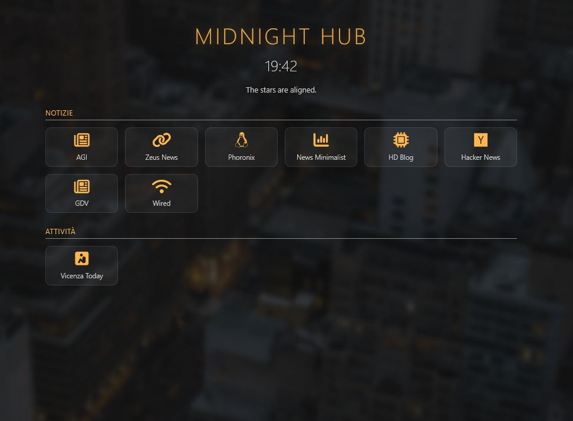

# Midnight Hub

A sleek, self-hosted dashboard and link aggregator designed for a relaxed, night-mode aesthetic. Organize your favorite bookmarks into categories with a minimalist interface and a built-in administration panel. Midnight Hub is designed for users who value simplicity and visual comfort.



---

## ✨ Features

* **Minimalist Design:** Dark-themed UI with background blur effects and smooth transitions.
* **Dynamic Clock:** Real-time clock display with a custom greeting.
* **Link Categorization:** Automatically groups your links by category.
* **Admin Panel:** Secure management system to add, edit, or delete links.
* **Drag & Drop Sorting:** Easily reorder your links using drag'n'drop.
* **Responsive:** Works beautifully on desktops, tablets, and smartphones.
* **JSON Powered:** No complex SQL database setup required; all data is stored in a simple `data.json` file.

---

## 🛠️ Tech Stack

* **Frontend:** HTML5, CSS3 (Custom Variables & Flex/Grid), JavaScript (Vanilla).
* **Backend:** PHP (CRUD operations).
* **Storage:** JSON.
* **Libraries:** [FontAwesome 6.4.0](https://fontawesome.com/) for icons, [SortableJS](https://sortablejs.github.io/Sortable/) for drag-and-drop functionality.

---

## 🚀 Getting Started

### Prerequisites
* A web server with **PHP 7.4 or higher** installed (e.g., Apache, Nginx, XAMPP).
* Write permissions for the directory (to allow PHP to update `data.json`).

### Installation
1.  **Clone the repository**
2.  **Move files to your server:**
    Upload all files to your web directory (subfolder supported).
3.  **Permissions:**
    Ensure the server has permission to write to `data.json`:
    ```bash
    chmod 664 data.json
    ```
4.  **Configure Admin Password:**
    Open `admin.php` and change the `$PASSWORD` variable:
    ```php
    $PASSWORD = 'your-secure-password';
    ```

---

## ⚙️ Configuration

### Background Image
To change the background, simply replace `background.jpg` in the project folder or update the URL in `style.css`.
